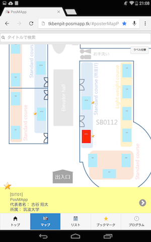
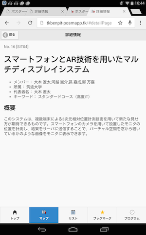
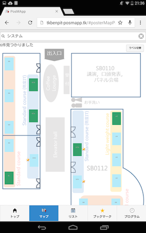
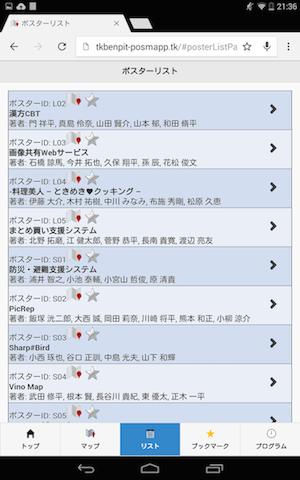
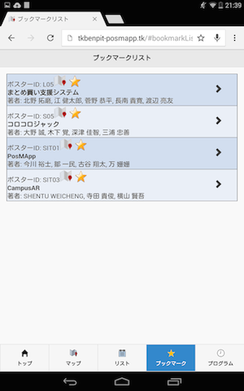
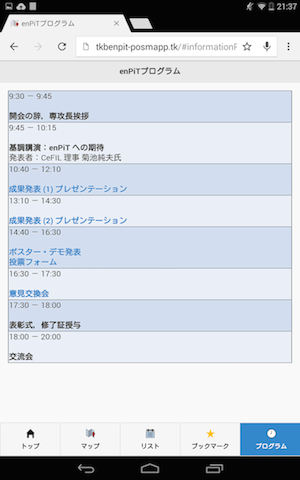

# PosMApp 使用マニュアル
=======

## 概要
PosMAppはポスター展示会向け案内アプリケーションです。  
お手持ちのスマートフォンやタブレットなどで利用可能です。  
大きく分けると以下のような機能があります。

- トップページ
- ポスターマップ
- ポスター情報閲覧
- ポスター一覧表示
- ポスターへのブックマーク
- ブックマークリスト表示
- ポスタータイトル検索
- イベントプログラム表示（タイムテーブル）

## 各画面説明
### トップページ
**

- 各機能へリンクするアイコンが表示されています
- そのイベントを示すロゴや運営元などが表示されています
 
### ポスターマップ画面
**

- 青く表示されている四角いアイコンがポスターのブースを示しています
- これを**ポスターアイコン**と呼びます
- タップされるとポスターアイコンが赤くなります
- 赤いポスターアイコンに対応しているポスターの情報が画面下部の黄色いエリアに表示されます
- 黄色いエリアの右端にある”＞”をタップするとポスター情報閲覧画面へ遷移します。
- 星マークをタップするとブックマークをつけることができます
- ブックマークに追加するとブックマークリストに追加され、ポスターアイコンの近くに星が表示されます

### ポスター情報閲覧
**

以下の情報が閲覧できます。

- ポスターのタイトル
- メンバー
- 所属
- 代表者名
- キーワード

### ポスタータイトル検索機能（マップ上のみ）
**

- ポスターマップ画面の上部にあるフォームにキーワードを入力して送信するとタイトルにキーワードを含むポスターのポスターアイコンが緑になります。
- 緑になっていても動作は青色の状態と変わりません。
- フォーム右端の”×”ボタンを押すと表示が元に戻ります。

### ポスターリスト
**

- すべてのポスターを一覧表示します。スクロール可能です
- 右端の”＞”ボタンからポスター情報閲覧画面へ遷移可能です
- ID横のアイコンからこのポスターの位置を示すためにポスターマップへ遷移します
- 星マークをタップするとブックマークに追加・削除可能です

### ブックマークリスト
**

- 動作はポスターリスト画面に準じます
- ブックマークされたポスターのみが表示されます
- ブックマーク解除した場合はこのリストから削除されます

### プログラム表示
**

- このイベントのタイムスケジュールを表示します
- ポスター発表の時間を示すタイトルから直接マップ画面に飛ぶなどできます