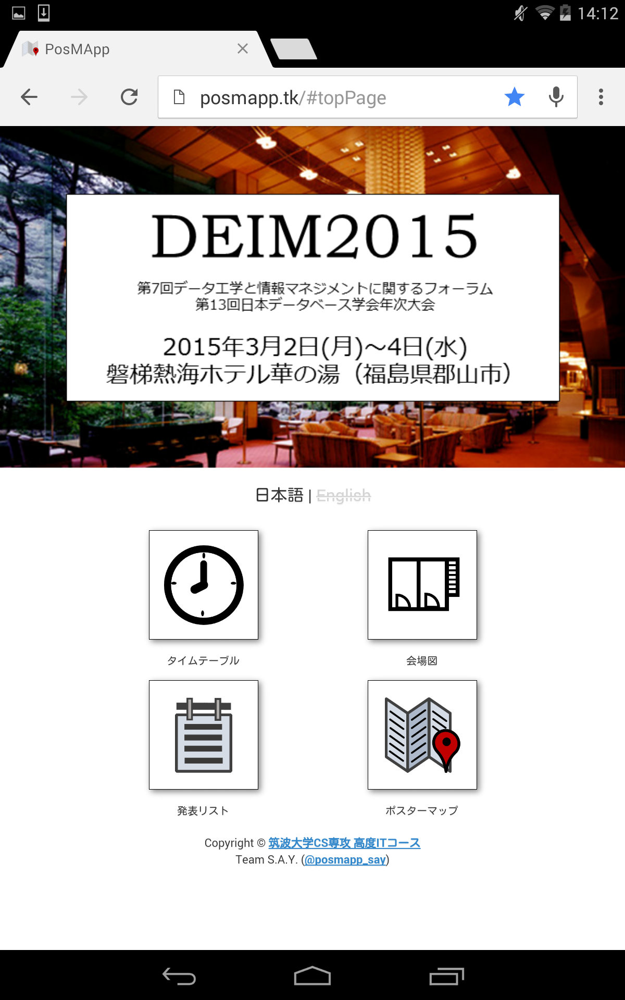
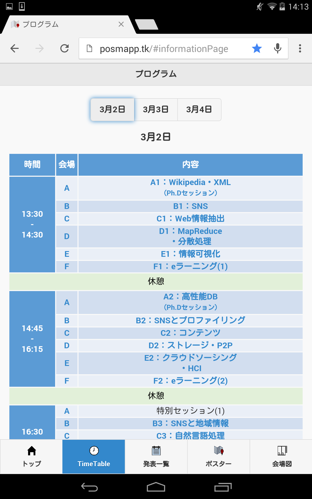
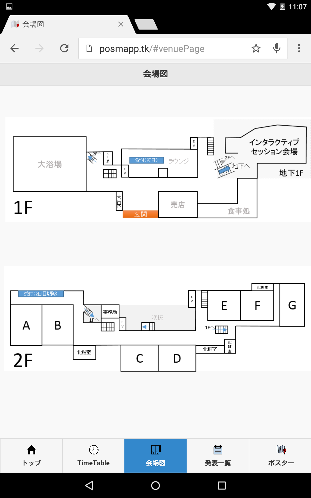
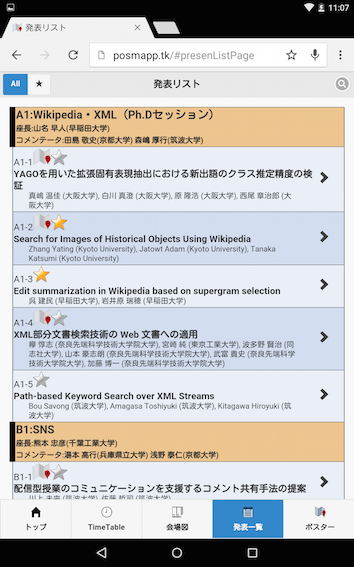
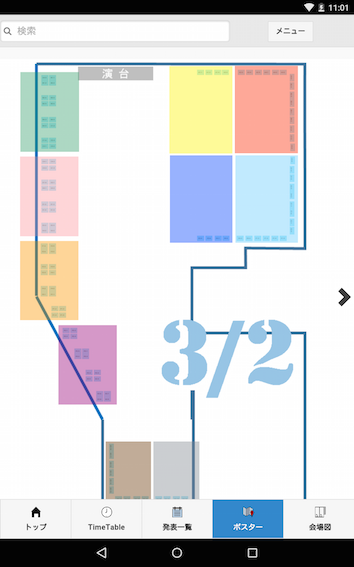

# PosMApp 使用マニュアル

## 概要
PosMAppはポスター展示会向け案内アプリケーションです。  
お手持ちのスマートフォンやタブレットなどで利用可能です。  
大きく分けると以下のような機能があります。

- ポスターマップ
- ポスター情報閲覧
- ポスター一覧表示
- ポスターへのブックマーク
- ブックマークリスト表示
- ポスタータイトル検索
- イベントプログラム表示（タイムテーブル）

## 各画面説明
### トップページ
**

- 各機能のアイコンをタップすることで、各機能の画面へ遷移します

### タイムテーブル
**

- このイベントのタイムスケジュールを表示します
- 上部の日付ボタンで日付を切り替えることができます
- 内容をタップすると、その発表リストのセッションまでジャンプします

### 会場マップ
**

- このイベントが行われる会場のマップを表示します

### 発表リスト
**

- すべての発表を一覧表示します。スクロール可能です
- 各発表の右端の"＞"ボタンまたはから、発表情報閲覧画面へ遷移可能です
- マップアイコンが付いている発表は、ポスターがあります。
- マップアイコンをタップすると、ポスターマップに遷移し、その発表のポスターの場所を示します。
- 各発表の星マークをタップすると、ブックマークに追加・削除可能です
- 左上にあるトグルボタンで、発表リストとブックマークリストを切り替えることができます
- ブックマークリストには、ブックマークした発表の一覧が表示されます
- 右上のボタンをタップすると、検索のヒントが表示されます
 
### ポスターマップ
**

- 青く表示されている四角いアイコンをポスターアイコンと呼びます
	- 各ポスターのブースを示しています
	- タップされるとポスターアイコンが緑色になり、右下に基本情報が表示されます
	- 基本情報パネルをタップすると、基本情報が非表示になります
	- 基本情報パネル上の星アイコンをタップすると、そのポスターがブックマークされます
		- ブックマークされたポスターには、マップ上で星マークが付きます
		- ブックマークリストにも登録されます
	- 基本情報パネルの右端の"＞"ボタンをタップすると、そのポスターの詳細情報を表示します
- 大きく色が付いている長方形の部分をタップエリアと呼びます
	- この部分をタップすると、その部分にズームインされ、ポスターアイコンを大きく見ることができます
	- ズームインすると右上に戻るボタンが表示され、それをタップするとズームアウトされます
- マップの左右端にある矢印をタップすると、日付を切り替えることが出来ます
	- 日付は、マップ上のアイコンが無い場所に表示されています
- マップ上をドラッグすると、マップを移動させることができます
- ドラッグした後、マップ上をダブルタップすると、マップを元の位置に戻すことができます
  
  
---
ver 2.0  最終更新日 2014/01/27